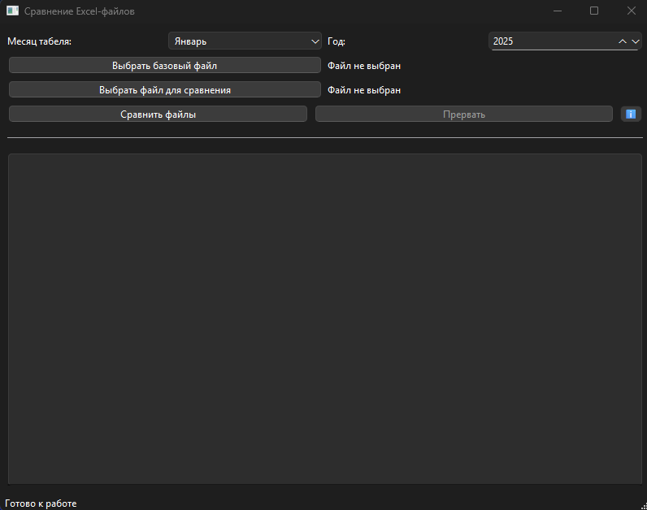

# Timekeeper


Программа для сравнения Excel-файлов табелей учета рабочего времени с графическим интерфейсом.



## Возможности

- Сравнение двух файлов формата XLS/XLSX/XLSM
- Визуальное выделение различий в исходных файлах
- Генерация отчетов с классификацией расхождений:
  - Различия с отметками "ВВ"
  - Различия с отметками "ДП"
  - Прочие различия
  - Отсутствующие сотрудники
- Поддержка Drag and Drop для выбора файлов
- Указание периода табелирования (месяц и год)

## Требования

- Python 3.8+
- Библиотеки:
  - PyQt6
  - pandas
  - openpyxl

## Установка

1. Установите зависимости:
```bash
pip install PyQt6 pandas openpyxl
